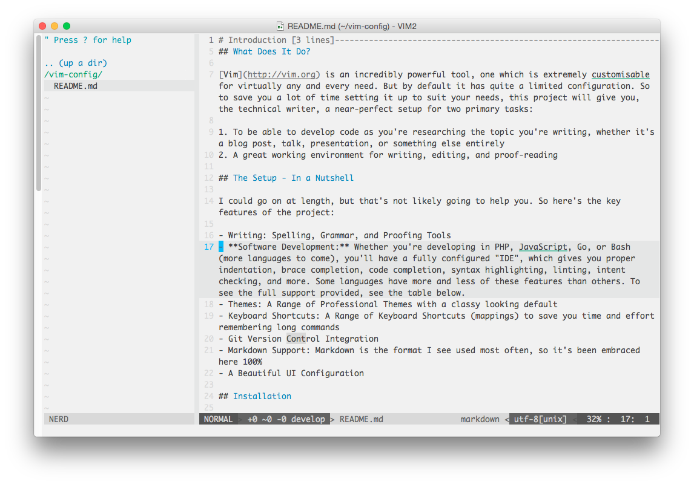

# Introduction

Welcome to Vim for Technical Writers. The aim of this project is to provide a professional Vim configuration which is just what technical writers, specifically those who specialise around software development, web application development, need.



## What Does It Do?

[Vim](http://vim.org) is an incredibly powerful tool, one which is extremely customisable for virtually any and every need. But by default it has quite a limited configuration. So to save you a lot of time setting it up to suit your needs, this project will give you, the technical writer, a near-perfect setup for two primary tasks:

1. To be able to develop code as you're researching the topic you're writing, whether it's a blog post, talk, presentation, or something else entirely
2. A great working environment for writing, editing, and proof-reading

## The Setup - In a Nutshell

I could go on at length, but that's not likely going to help you. So here's the key features of the project:

- **Writing:** Spelling, Grammar, and Proofing Tools
- **Software Development:** Whether you're developing in PHP, JavaScript, Go, or Bash (more languages to come), you'll have a fully configured "IDE", which gives you proper indentation, brace completion, code completion, syntax highlighting, linting, intent checking, and more. Some languages have more and less of these features than others. To see the full support provided, see the table below.
- **Themes:** A Range of Professional Themes with a classy looking default
- Keyboard Shortcuts: A Range of Keyboard Shortcuts (mappings) to save you time and effort remembering long commands
- Git Version Control Integration
- Markdown Support: Markdown is the format I see used most often, so it's been embraced here 100%
- A Beautiful UI Configuration

## Installation

At this stage, the entire configuration is stored in a single .vimrc file. In time I'm planning to change that. But for now, all you need to do is to clone the repository, then copy the .vimrc file to your home directory (Windows instructions to come).

As the setup uses [Vundle](https://github.com/gmarik/Vundle.vim), you need to firstly clone that repository, using the following command:

```bash
git clone https://github.com/gmarik/Vundle.vim.git ~/.vim/bundle/Vundle.vim
```

When that's done, start Vim and run `BundleInstall`. This will bring in all the required plugins. When that's done, restart Vim and you're ready to go.

## Software Language Support

|Language|Support|
|---|---|
|PHP|Partial Support|
|JavaScript|Partial Support|
|Go|Full Support|
|Ruby|Partial Support|
|Python|Not supported yet|

## Follow Development

If you're keen to watch the development unfold, follow @vim4techwriters, or subscribe to the repository feed.

## Contribute to Development

If there's something that you see is missing, broken, or not done correctly let me know. Either [create an issue](https://github.com/settermjd/vim-for-technial-writers/issues), or fork the repository, make a patch, and submit a [pull request](https://help.github.com/articles/using-pull-requests/).
